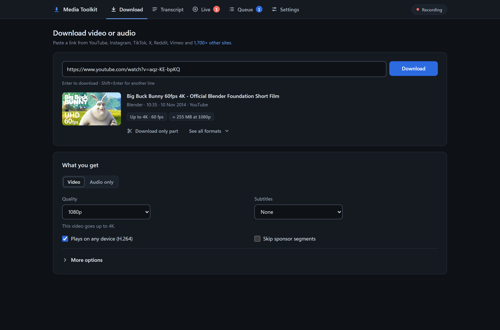
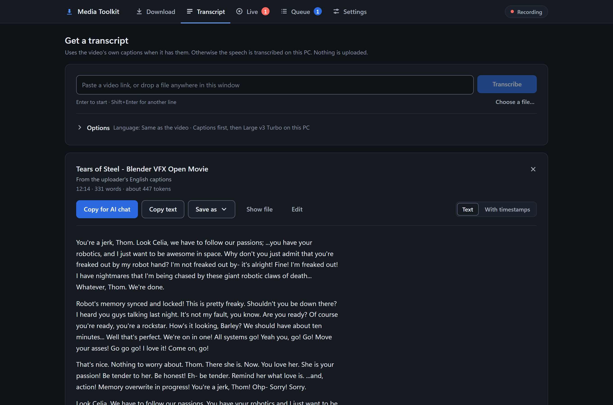
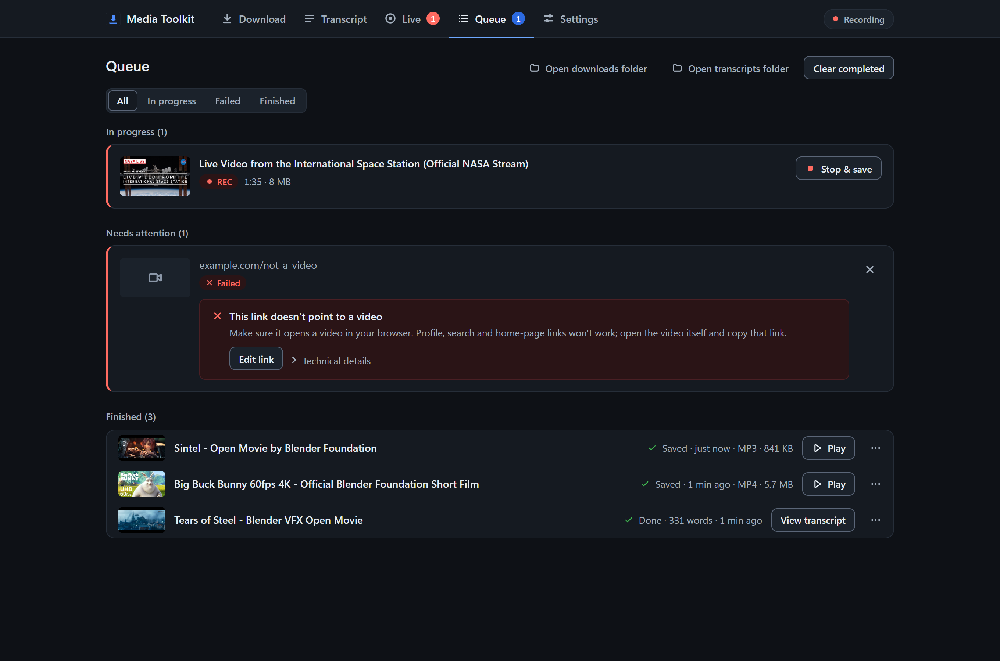
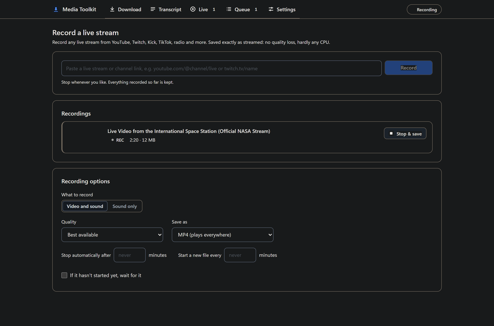
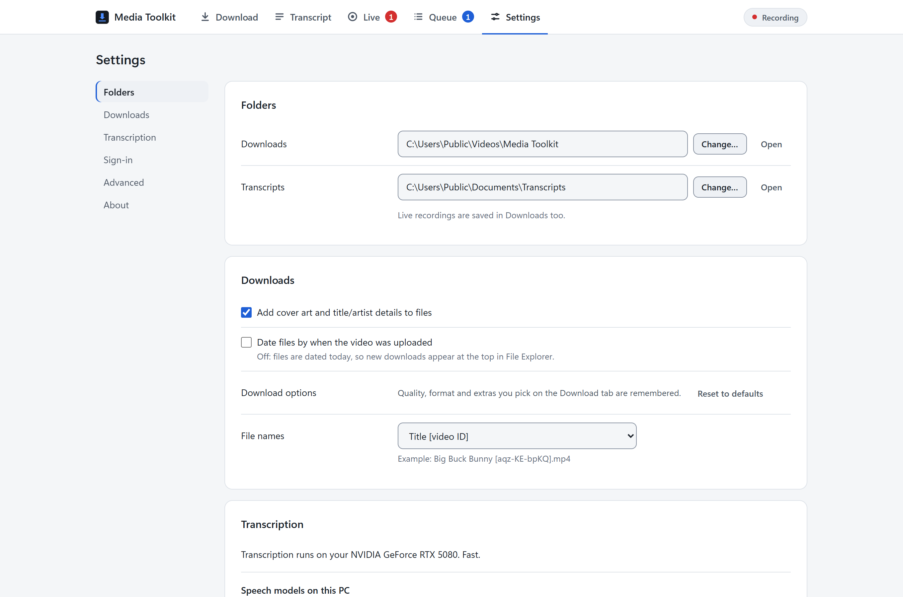

<p align="center">
  
</p>

<h1 align="center">Media Toolkit</h1>

<p align="center">
  Download videos, record live streams, and turn any video into text you can paste into an AI chat.<br>
  Everything runs on your own Windows PC.
</p>

<p align="center">
  <a href="https://github.com/AnotherAH/media-toolkit/releases/latest"></a>
  
  <a href="LICENSE"></a>
  <a href="https://github.com/AnotherAH/media-toolkit/actions/workflows/ci.yml"></a>
</p>

<p align="center">
  
</p>

## What it does

**Download from 1,700+ sites.** YouTube, Instagram, TikTok, X, Reddit, Vimeo,
Facebook, Twitch and many more. Pick a quality, save only the audio, cut out
a part, grab a whole playlist or just the newest videos of a channel, add
subtitles, skip sponsor segments, or convert the result with your graphics
card.

**Transcripts in seconds.** Paste a link and get clean text, ready for any AI
chat. If the video has captions you have them in about a second; if not, the
speech is transcribed on your PC with [Whisper](https://github.com/SYSTRAN/faster-whisper),
using your NVIDIA graphics card when you have one. Drop a local video or
audio file to transcribe it too. Save as text, notes with timestamps,
subtitles or JSON.

**Record live streams.** Video and sound together, stop whenever you like and
keep everything recorded so far. It can wait for a scheduled stream to start,
split long recordings into parts, and survives short network drops.

<table>
  <tr>
    <td width="50%"></td>
    <td width="50%"></td>
  </tr>
  <tr>
    <td align="center"><sub>Transcripts ready to paste into an AI chat</sub></td>
    <td align="center"><sub>Every job with progress, errors and a way forward</sub></td>
  </tr>
  <tr>
    <td width="50%"></td>
    <td width="50%"></td>
  </tr>
  <tr>
    <td align="center"><sub>Live recording with stop and save</sub></td>
    <td align="center"><sub>Light and dark themes follow Windows</sub></td>
  </tr>
</table>

## All features

### Downloading
- Works with **1,700+ sites** through yt-dlp: YouTube, Instagram, TikTok, X, Reddit, Vimeo, Facebook, Twitch and more
- Paste one link or many at once; a live **preview** shows title, length, best quality and an estimated file size
- **Video or audio only**: quality from 480p up to 4K, "Plays on any device" (H.264) mode, or the smallest file
- Audio as **MP3, M4A, Opus, FLAC or WAV**; containers MP4, MKV or WebM
- **Download only part** of a video (from/to times), or pick an **exact format** from the full format list
- **Playlists and channels** right in the preview: all, first or latest N, or specific items, with filters for length, upload date, title, views and file size, reverse or shuffled order, and "join everything into one file"
- **Quick update** for channels: skip videos you already have and stop at the first known one
- **Subtitles** (official or automatic, any language), embedded or as files
- **SponsorBlock**: cut out or just mark sponsor segments
- **Chapters**: keep them, split into one file per chapter, or remove chapters by name
- **Re-encode** with your graphics card (NVIDIA, Intel or AMD, only offered when it really works) or processor, and **even out the volume**
- Extras: cover art and title/artist tags, description, top comments, thumbnail, a shortcut to the page, technical details
- File name presets (title, channel, date) or your own pattern
- **Sign-in for private or age-restricted videos**: use your browser's sign-in, sign in through a separate window, or paste cookies

### Transcripts
- Uses the video's **own captions first**, so most transcripts are ready in about a second
- Otherwise transcribes **on your PC with Whisper**, on your NVIDIA graphics card or processor, with automatic fallback if one does not work
- **Drop any local video or audio file** onto the window to transcribe it
- **Language choice** with native names (Persian, Arabic, Chinese, Hindi and 20+ more), or **translate to English**
- A clean **reader** with paragraphs or timestamps, word and token count
- **Copy for AI chat** adds the title, channel and link; long transcripts can be **copied in parts** that fit one message each
- Save as **text, notes with timestamps, SRT, VTT or JSON**
- Recent transcripts stay one click away
- Speech models from tiny (75 MB) to large (3 GB); the app recommends one for your hardware, checks downloads and repairs damaged ones

### Live recording
- Record **any live stream** yt-dlp can open: YouTube, Twitch, Kick, TikTok, radio and more
- **Video and sound together**, copied as streamed: no quality loss and almost no CPU use
- **Stop whenever you like** and keep everything recorded so far; the file is always playable
- **Survives network drops** and reconnects on its own
- **Waits for scheduled streams** to start, up to a time you choose
- Stop automatically after N minutes, or start a new file every N minutes
- Sound-only recording for radio and talk streams

### The app
- **Each tab shows its own progress and results**; the Queue keeps every job, even across restarts
- **Errors in plain language with a fix button** (sign in, retry, repair ffmpeg) and technical details one click away
- Try again, remove, clear with undo, play, open and show in folder on every job
- **Remembers your choices** between launches; settings save themselves
- **Light and dark themes** that follow Windows, keyboard shortcuts, full **right-to-left** support
- **Installer or portable zip**; updates to site support (yt-dlp) from inside the app
- Keeps working in the background if you close the window; opening it again returns to the running app

## Why Media Toolkit

| | Media Toolkit | Online downloader sites | yt-dlp on the command line | Typical paid downloaders |
|---|---|---|---|---|
| Sites supported | 1,700+ (yt-dlp) | a handful | 1,700+ | dozens to hundreds |
| Transcripts for AI chats | built in, captions or local Whisper | no | no | rarely |
| Live stream recording that can be stopped and kept | yes | no | partly (no clean stop and keep) | some |
| Runs on your PC, nothing uploaded | yes | no, your links go to their servers | yes | yes |
| Ads, accounts, tracking | none | usually ads and trackers | none | accounts, upsells, limits |
| Easy to use | yes | yes | needs typing commands | yes |
| Price and license | free, open source (MIT) | free with ads | free, open source | paid or limited free tier |

In short: it gives you the full power of yt-dlp and ffmpeg without the command line, adds local
speech-to-text that turns any video into text for an AI chat, and keeps everything on your own PC.

## Install

1. Download **`MediaToolkit-Setup-1.2.0.exe`** from the
   [latest release](https://github.com/AnotherAH/media-toolkit/releases/latest).
2. Run it. It installs for your user only, so there is no administrator
   prompt, and adds Start menu and desktop shortcuts.
3. The installer is not code-signed yet, so Windows SmartScreen may say it
   "protected your PC". Choose **More info › Run anyway**. You can compare the
   file with `SHA256SUMS.txt` from the same release first:
   `certutil -hashfile MediaToolkit-Setup-1.2.0.exe SHA256`

Prefer not to install? Download the **portable zip**, unpack it anywhere
(a USB stick works) and run `MediaToolkit.exe`. It keeps its settings and
models in a `data` folder next to it.

Everything the app needs is included: Python, yt-dlp and ffmpeg. Two things
are downloaded later, only if you want them:

| Download | Size | When |
|---|---|---|
| Speech model | 75 MB to 3 GB | The first time a video without captions is transcribed |
| GPU support (NVIDIA cuBLAS) | 528 MB | Offered in Settings on PCs with an NVIDIA graphics card |

Upgrading keeps your settings, models and files. The uninstaller asks before
removing the app's data folder, and never deletes your downloads.

## First steps

1. **Get a transcript:** open the Transcript tab, paste a video link and press
   Enter. Press **Copy for AI chat** and paste it into any chatbot.
2. **Download a video:** paste a link on the Download tab, check the preview,
   choose Video or Audio only, press Enter.
3. **Private or age-restricted videos:** go to Settings › Sign-in for private
   videos and let the app use the sign-in from your browser.

When a site stops working, it has usually changed something that yt-dlp has
already fixed: **Settings › About › Site support** checks for an update.

## Privacy

There is no account, no tracking and no telemetry. The app talks only to:

- the sites you paste links from (through yt-dlp), and SponsorBlock when you
  turn on sponsor skipping;
- Hugging Face, to download a speech model the first time one is needed;
- PyPI, to download GPU support or a yt-dlp update when you ask for it;
- GitHub, when you press Check for updates.

Your files, transcripts and sign-in cookies stay on your PC. The app's
window talks to a small server on `127.0.0.1` that refuses requests from
websites, other computers and anything without the per-launch key.

## Command line

```text
MediaToolkit.exe                       open the app (or return to the running one)
MediaToolkit.exe --port 9000           use a fixed port
MediaToolkit.exe --browser             open in your normal browser instead of the app window
MediaToolkit.exe --server              run without a window; keeps going until stopped
MediaToolkit.exe --diagnose MODEL      write a report on a speech model to diagnose.txt
MediaToolkit.exe --diagnose MODEL --repair   ...and download that model again
```

`--host` can make the server reachable from other devices on your network; it
then prints an address with an access key and requires it on every request.
Only use it on a network you trust.

The app keeps its log in `%LOCALAPPDATA%\Media Toolkit\app.log`
(Settings › About › Open log file).

## Building from source

Needs Windows 10/11 and Python 3.11 or newer (3.13 recommended).

```bat
git clone https://github.com/AnotherAH/media-toolkit.git
cd media-toolkit
setup.bat
Start.bat
```

`setup.bat` creates a private environment in `.venv`, installs the
dependencies and downloads ffmpeg into `bin\`. To build the installer and the
portable zip you also need [Inno Setup 6](https://jrsoftware.org/isinfo.php)
(`winget install JRSoftware.InnoSetup`):

```bat
.venv\Scripts\python.exe -m pip install -r requirements-build.txt -c requirements-lock.txt
.venv\Scripts\python.exe tools\build.py
```

The results land in `dist\`. Pushing a `v<version>` tag builds the same files
on GitHub Actions into a draft release. See [CONTRIBUTING.md](CONTRIBUTING.md)
for tests and guidelines.

## Responsible use

Media Toolkit is a tool for saving and transcribing media you have the right
to use: your own uploads, public-domain and Creative Commons works, content
whose license allows it, or personal copies where your local law permits
them. Respect copyright and the terms of the sites you use. Do not use it to
redistribute other people's work.

Media Toolkit is not affiliated with or endorsed by YouTube, Google,
Instagram, Meta, TikTok, X, Twitch or any other site or service it
mentions. Their names are used only to describe what the app
works with.

## Built on

Media Toolkit is a thin layer over excellent open-source projects:

| Project | What it does here |
|---|---|
| [yt-dlp](https://github.com/yt-dlp/yt-dlp) | Every site, format selection, playlists, subtitles, SponsorBlock, live stream links |
| [FFmpeg](https://ffmpeg.org) ([yt-dlp builds](https://github.com/yt-dlp/FFmpeg-Builds)) | Joining, converting, recording and audio decoding |
| [faster-whisper](https://github.com/SYSTRAN/faster-whisper) and [CTranslate2](https://github.com/OpenNMT/CTranslate2) | Speech recognition |
| [Silero VAD](https://github.com/snakers4/silero-vad) | Skipping silence |
| [SponsorBlock](https://sponsor.ajay.app) | Sponsor segment data (CC BY-NC-SA 4.0) |
| [FastAPI](https://github.com/fastapi/fastapi) and [Uvicorn](https://github.com/encode/uvicorn) | The local server behind the window |

The installed app includes the license of every component in
`THIRD-PARTY-NOTICES.txt` (also under Settings › About › Third-party
licenses). Screenshots show Blender Foundation open movies
([CC BY 3.0](https://creativecommons.org/licenses/by/3.0/), © Blender
Foundation | blender.org).

## License

[MIT](LICENSE). The installer also contains third-party software under its
own licenses, including FFmpeg under the GPL; see `THIRD-PARTY-NOTICES.txt`.
